# Dense -- The powerful capslock

# 〇、概要

## 1. 什么是Dense？

**Dense**，即密集。这个脚本以capslock键为基础，构造了大量的热键，可以认为构成了一个简单的热键系统，旨在为 **Windows（10以上）** 用户提供更方便的键盘操作。简单来说，其功能分为以下几大类别：

1. 基于光标的文本操作

2. 符号热键，方便输入符号

3. 数字热键，方便输入数字

4. （基于数字热键的）窗口选取

5. （基于数字热键的）应用快捷方式

6. （基于数字热键的）虚拟桌面切换

7. 模拟部分鼠标操作

8. 其他

已然存在一些优秀的 CapsLock热键脚本。据考究，最经典的可能是 [Vonng/Capslock](https://github.com/Vonng/Capslock)，或许是最先提出了用CapsLock实现热键的设计思路的。比较有名的是 [wo52616111/capslock-plus](https://github.com/wo52616111/capslock-plus)，更致力于功能的多样性。我的脚本，部分参考了他们的设计，也提出了一些新的 想法。我认为，此脚本的灵感意义大于脚本本身，可以为其他设计者提供参考。本脚本使用**MIT开源协议**。

我的脚本主要有以下特点：

1. **致力于操作的连贯性**。使用此脚本可以显著减少从鼠标到键盘的来回切换，几乎完全避免手指在不同键位区之间的切换。

2. **致力于手感的舒适度**。所有热键都被设置在最容易触摸的地方，即字母区+capslock + alt + 空格， 甚至不需要数字区，ctrl，win。左右手分工明确。

3. **更多，（也许）更系统**。将W/A/S/D等键作为修饰键，从而实现丰富的功能。

4. 提供一种**独特的方式控制鼠标**。

## 2. 如何安装？

本脚本不需要安装，可以直接运行。但是，本脚本运行过程中会产生配置文件，您最好将它放置在一个空文件夹中以避免文件混乱。

可以运行的文件有

1. Dense.ahk，要运行它，您需要安装autohotkey环境。

2. Dense.exe，只要是windows系统就可以运行，但只有在windows10以上才能提供完整功能。

## 3. 关于这篇README

我在设计这些热键时，考虑了如下几个因素，重要性从上往下递减：

1. 是否容易操作

2. 是否便于记忆，也即能否从热键的键位联想到功能。

3. 相似功能的热键是否靠在一起

4. 覆盖到相同键位的热键 是否具有一定的关联性

**考虑到此脚本所包含的热键数量实在太多，直接列表阐述功能难以使人接受并记忆，所以有必要说明这些热键设计成这样的原因。**

本文将分四个层次讲解。

本文的图片全部使用 [Keyboard Layout Editor](http://www.keyboard-layout-editor.com/) 制作。

* 科普：什么是**前缀(prefix)后缀(postfix)键**？比如在热键ctrl+shift+c中，ctrl+shift是前缀键，c是后缀键。前缀键的作用是修饰，在这个修饰下，后缀键实现特定功能。

# 一、以 CapsLock 为前缀

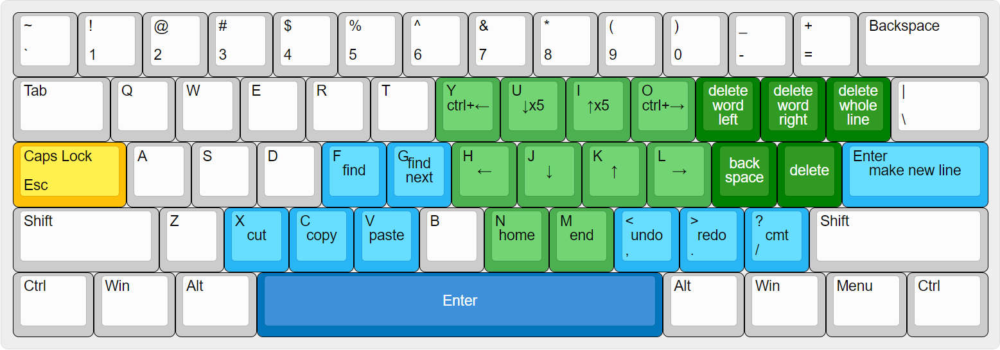

a.金色：前缀键    b.天蓝色：杂项功能键    c.深蓝色：重映射按键

d.淡绿色：光标移动相关    e.深绿色：删除字符相关

1. **HJKL**对应**左下上右**。这是属于vim编辑器的传统。本来，我想使用ijkl作为上左下右，因为这更符合一般用户的手感。但我发现使用vim键位更便于放置其他热键，故作罢。

2. **YUIO**，它们相当于HJKL对应功能的升级，故放在HJKL的正上方。↓x5的意思是连续按5次↓键。

3. **5个与删除有关的键**被放在小拇指所控制的键区。这是因为平常一般使用小拇指去按撤回键。本着让所有常用功能落在字母键区的原则，我为这些删除功能设置了热键。

4. **n，m对应home和end**，**逗号和句号对应撤销和重做。** 乍看这似乎和上面的HJKL不相映衬，但从联想的角度看，m和n似乎是一对（尤其是数学中设未知数经常使用它们为一对），而<和>本就是一对，且天然地具有后退和前进的涵义。

5. **空格被映射为回车**。显然，回车离小拇指还是远了一些，使用空格更方便。

6. **而回车被赋予了向下开新行的功能**。

7. **a, s, x, c,youguan f, g, /,** 这些热键的功能相当于以capslock代替ctrl。ctrl按起来实在不方便。

# 二、以 CapsLock + W/A/S/D 为前缀

从这里开始就涉及到了本脚本的灵感所在。

在别的capslock增强脚本中，一般仅使用capslock以及常规修饰键，如ctrl，win，alt等，作为前缀。但这些键往往不方便按，要按这些键，常常要脱离常规的打字手形，不利于输入的连贯性。

而使用W,A,S,D作为修饰键，则避免了这些缺点。同时，由于它们是字母，相比ctrl，win，alt这些抽象的词语，更利于联想，也就更方便记忆。

## 1. CapsLock + W，窗口操作

W是window的首字母，所以 CapsLock + W 可以理解为**窗口操作**。

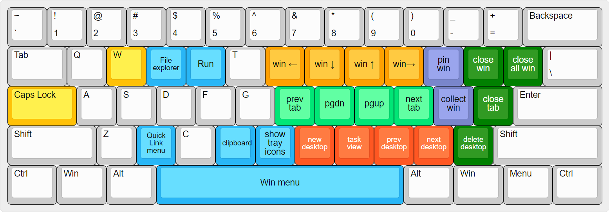

a. 金色：前缀键    b.天蓝色：杂项功能键    c. 亮绿色：窗口内操作

d. 橘色：窗口操作    e. 红色：虚拟桌面操作    f.紫色：高级窗口操作

g. 深绿色：删除相关

1. **HJKL**对应**向左选择标签页，向下翻页，向上翻页，向右选择标签页**。这与原先的HJKL对应左下上右相契合。

2. **UIOP**对应**win+左下上右**。这属于窗口操作。它们没有窗口内操作的使用频率高，故放在HJKL上方。

3. **n,m,逗号,句号，对应虚拟桌面操作。**<和>，容易让人联想到向前和向后，十分适合作为虚拟桌面的切换按键，故如此设置。至于n和m，则是因为在同一行，顺带赋予了新建虚拟桌面（[n]ew）和查看任务视图（任务视图可以视为一个[M]enu）的功能。

4. **pin win 指的是将某一窗口置顶**。因pin首字母为P，故放在p键上。

5. **collect win 比较特殊**。按下它时，当前窗口隐藏；释放它时，该隐藏窗口弹出。这一功能主要用于将窗口放到别的虚拟桌面。先按下collect win，再切换虚拟桌面，最后释放collect win，达到在虚拟桌面间转移窗口的目的。之所以放在分号键上，与其他热键的布局有关，具体请看三、3。

## 2. CapsLock + A，选择文本

传统 Ctrl + A 是全选，具有选择的涵义。所以 CapsLock + A 可以理解为选择操作。

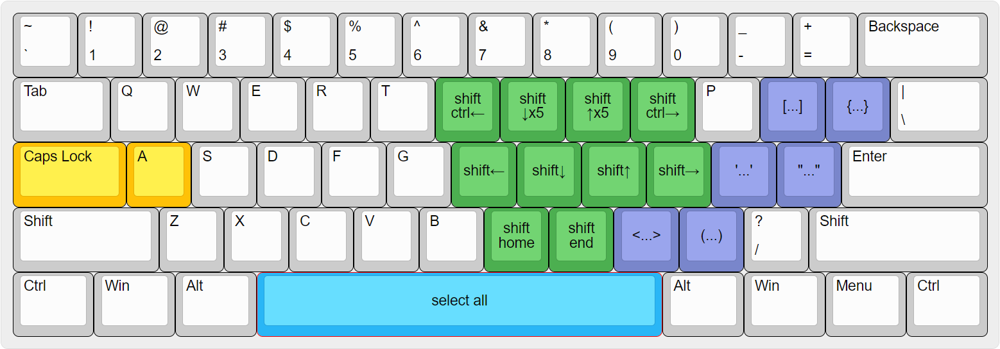

a. 金色：前缀键    b：绿色：基于光标的文本操作    c. 将高亮文本以某些字符包围

1. 对于所有的绿色热键，它们的功能相当于按下CapsLock的同时按下shift，以达到选择文本的目的。可以以下图作为对比。然而，对于一般的键盘，按下capslock时不方便按shift，故选择a键作为替代。
   
   

2. 对于所有的紫色热键，它们的功能是将选择后高亮的文本用特定符号包围。比如<...>指的是将所选文本以<和>包围。

## 3. CapsLock + S，符号输入

S是Symbol的首字母，所以 CapsLock + S 可以理解为符号输入。

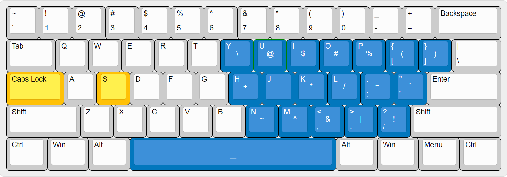

a. 金色：前缀键    b. 深蓝色：重映射按键

第一行：

1. **Y对应反斜杠**。反斜杠最长出现的地方是windows的文件路径。在其他的平台，比如著名的linux，一般使用正斜杠 / 分割文件路径。所以每当你打出这个符号，你都想问一句：why（**Y**）微软偏偏使用反斜杠？

2. **U对应艾特**。@是一个特殊的字符，一般只有在写邮件地址时会用到，来表明这是一个邮件地址。所以它是邮件地址的特殊标识符（**U**nique identifier)。

3. **I对应美元**。在linux终端中，提示输入（**I**nput）的字符就是美元。同时，把美元给**I**，岂不美哉？

4. **o对应井字符**。这是因为#的官方名称是**O**ctothorpe。octo这一前缀代表8，意味着#外侧有8条边。以octo为前缀的有：october（八月），octopus（章鱼）。

5. **P对应百分号**。百分号的英文是percent。

6. **方括号对应圆括号**。圆括号一般是9和0的大写，略有不便，故移到方括号处。

第二行：

1. **HJKL对应加减乘除**。HJKL是vim的经典，加减乘除是小学数学的经典，故放在一起。

2. **分号对应等于**。分号的大写是冒号，而冒号具有解释说明的涵义，与等于号相像。同时，在一些编程语言和传统的伪代码中，:=表示为变量赋值。分号又正好和加减乘除挨在一起，故将等于放在这里。

3. **引号对应反引号**。反引号就是数字键1左边的那个符号。虽然不常用但放在这里最合适。

第三行：

1. **逗号、句号对应与&、或|符号**。逻辑与和逻辑或天然一对，故放在成对的 逗号（大写为<） 和 句号（大写为>）上。

2. **正斜杠对应感叹号。** 正斜杠的大写是问号，正好和感叹号匹配。同时，感叹号一般用作逻辑非，非常适合放在与和或旁边。

3. **N和M对应波浪号~和插入符^**。之所以放在这里，是因为编程语言中，这二者常作为按位同或(XOR)和按位异或(XNOR)存在。这样，第三行就全是关于逻辑运算的符号了。

第四行：

1. **空格映射为下划线。** 我认为，下划线是一种可视化的空格。

## 4. CapsLock + D，数字输入

D是**D**igit的首字母，所以 CapsLock + D 可以理解为数字输入。

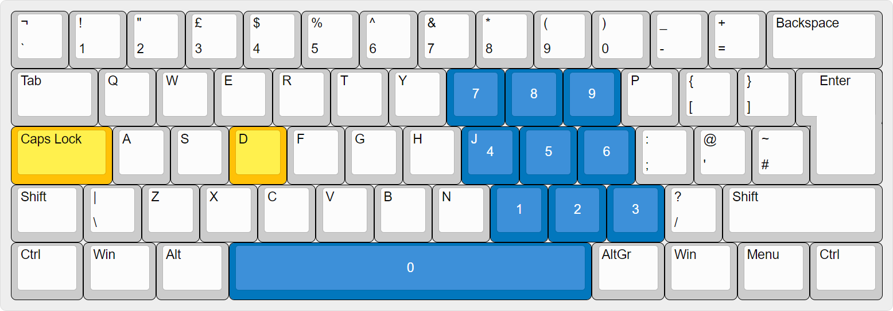

a. 金色：前缀键    b. 深蓝色：重映射按键

这些按键的布局同numpad相同，唯一缺失的是numpad的加减乘除和回车。不过，加减乘除可以方便地通过按Capslock+S来获取，回车可以按capslock+空格获取。

将数字热键放在这么容易触摸的地方，意味着我们可以实现更多的与数字有关的热键。我们称 CapsLock + D + X 这些热键为数字热键。数字热键在整个Dense热键系统的构建中扮演着重要的角色。如下。

# 三、以CapsLock + W/A/S + 数字 为前缀

这里的 “数字” 可以是字母区上面的那一行数字键，原则上你确实可以使用CapsLock + W/A/S + 数字键触发相应功能，但更方便的操作是使用 二 . 4 提及的数字热键， 这意味着你可以同时按住

**CapsLock + W/A/S + D + 数字热键后缀** 

来实现多样的功能。

是的，这些都是4键热键，看上去似乎很复杂。但你可以试着感受一下这些热键，你会发现其实相当的方便。

## 1. CapsLock + W + D，激活窗口

W是**w**indow的首字母，所以 这一前缀与窗口有关。你可以按对应的数字热键后缀，来激活\最小化 任务栏上的第x个窗口。

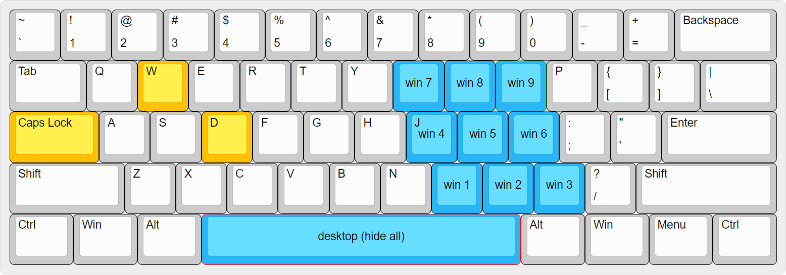

a. 金色：前缀键    b.天蓝色：功能键

由于微软没有所谓第0个窗口，所以CapsLock + W + D + 空格 将最小化所有窗口。

## 2. CapsLock + A + D，应用热键

这里 A 的含义不再是选择，而是应用程序（**A**pplication）。按住CapsLock + A + 数字 将打开事先绑定好的应用。一个按键多个含义，似乎不是个好主意。其实我本想把该功能放在 CapsLock + W 上的，但该热键已经被 三 .1占用。所以选择 A 是考虑到使用舒适性和Application首字母而做出的权衡。

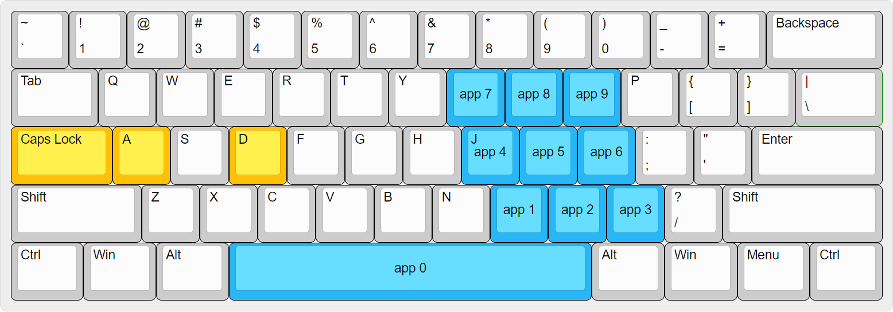

a. 金色：前缀键    b.天蓝色：功能键

如何绑定应用 ?   按CapsLock + Alt + A 打开绑定应用模式，此时会弹出相应窗口，提示你按下一个数字，来绑定当前激活的窗口。此脚本会自动找到窗口的运行路径，下一次按对应热键会自动打开该路径的应用。

应用路径存储在软件根目录的settings.ini文件中的 [Apps] 节，每次打开Dense脚本会从settings.ini读取这些路径。

你也可以手动绑定应用。只需修改settings.ini中[Apps]里对应数字后等号的内容为目标路径，并重启该脚本以手动绑定应用。

* 注意，不是所有窗口都可以被自动绑定，比如UWP应用（来自微软商店）的窗口。这是因为你无法通过运行UWP应用路径的方式来打开该应用（权限不足）。此时你就需要**手动绑定应用**。方法同上，但填写的并不是运行路径，而是如下命令，格式为：

*  **explorer.exe shell:appsFolder\APPID**

* 其中，APPID是对应应用的独特ID。你可以这样获得ID：打开powershell，输入StartApps，然后你就能获得 应用名称 与对应APPID 的映射表格。找到目标应用并复制对应的APPID即可。

## 3. CapsLock + S + D，切换虚拟桌面

这里的 S 不再是 Symbol 的首字母，而是切换（**S**witch）。 S，D 连起来即为 **Switch Desktop**，即你可以切换对应数字的虚拟桌面。

a. 金色：前缀键    b.天蓝色：功能键

由于微软没有第0个虚拟桌面，所以按 CapsLock + S + D + 空格 将打开 任务视图。

使用这一功能切换虚拟桌面，将会有一个窗口反馈，1秒后消失。

此功能是如何实现的？该脚本通过读取注册表（放心，它不修改注册表）确认当前虚拟桌面的序号，然后模拟若干次win+ctrl+←/→切换桌面。这意味着桌面切换动画会快速闪烁。如果您不喜欢这种动画效果，我推荐github上的一个项目[virtual-desktop-enhancer](https://github.com/sdias/win-10-virtual-desktop-enhancer)，不过该项目只适用于win10（win11未测试过）。

* 还记得之前的CapsLock + W + ；的collect win 功能吗？您可以先按住分号键，再切换虚拟桌面，最后松开分号，实现窗口在虚拟桌面间的转移。注意，按住分号后，即使松开w也不会导致其功能失效。

# 四、以CapsLock + ... + 伪数字键 为前缀

首先需要解释一下什么是**伪数字键**。按上文所述，你需要按Capslock+d+...来输入数字。但有时候按键D不适合（或不必要）与一些组合键一起按，比如x、c、v、f。这是就需要伪数字键了，它们是Capslock+d+...的后缀：空格，M，逗号，句号，j，k，l，u，i，o，分别对应0~9。它们不是真正的数字键，故称为伪数字键。

比如，我们称 J 为 “4的伪数字键”，其他的同理。

## 1. CapsLock + X/C/V + 伪数字键，数字化剪切板

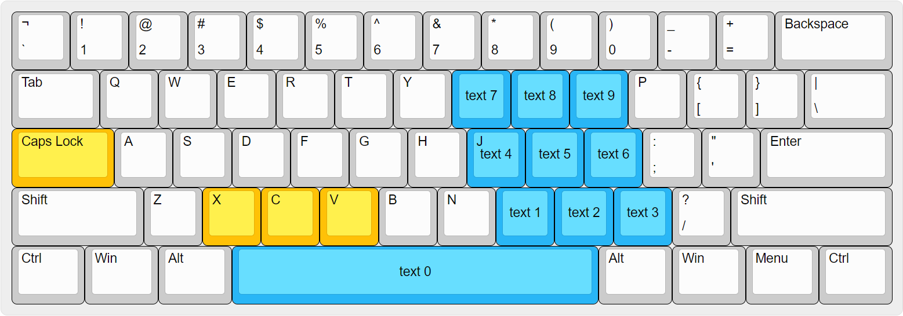

a. 金色：前缀键    b.天蓝色：功能键

**Capslock + X/C+ N的伪数字键**，将高亮文本剪切/复制到第N个文本中

**Capslock + V+ N的伪数字键**，将第N个文本粘贴到光标处。

这些文本存储在软件的运行内存中，软件关闭后会将这些文本存储到软件根目录的settings.ini 中，下次打开后会从 settings.ini 中读取上次存储的文本。

这些操作不会影响到系统原生剪切板。

只按Capslock+X/C/V 执行系统原生的剪切，复制，粘贴操作。由于存在CapsLock + X/C/V + 伪数字键 这些热键，为了避免冲突，CapsLock+X/C/V的功能在X/C/V键抬起的瞬间执行，且按下到抬起的过程中不能有其他按键干预。

这一功能暂未支持剪切复制粘贴图像和文件。

## 2. CapsLock + f + 伪数字键，输入Fn

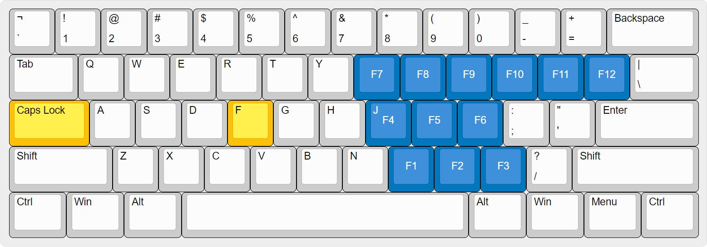

a. 金色：前缀键    b.深蓝色：重映射按键

由于模拟numpad中没有地方放F10~F12，我将他们放在了F9右侧。

这一功能在实际中没有太高的使用价值，因为

1. 能用到Fn的地方还是比较少的。

2. Fn常常搭配ctrl，alt，shift，win组合使用，但是在这一布局中难以完美且舒适地塞下ctrl，alt，shift，win这些键。

3. 用到这些功能的时候，往往不是在高强度键盘输入的时候，不会影响输入的连续性。

这一功能纯粹是因为可以实现，我就顺便实现了。

# 五、以CapsLock + q + 为前缀，模拟鼠标

使用键盘控制鼠标，是无法高效率地完全代替鼠标的。

但是，在某些特定的情境下，可以短暂使用键盘代替鼠标以实现键盘操作的连贯性。

比如，你想切换窗口控件焦点（文本框，按钮，以及其他出现在窗口中的元素），如果此时你的手在键盘上，一般情形下你需要把手移动到鼠标上，移动，点击，再把手移回键盘。这样的操作很影响键盘输入的连贯性。

所以，有必要设计一套方法，以键盘模拟鼠标操作，但又不以完全替代鼠标为目的。

我能想到的最佳方法是使用眼动追踪技术，如tobii。但硬件成本较高。

windows系统设置中，可以将numpad设置成鼠标键来操作鼠标，但是，实在是太不方便了。我称这种方法为经典方法。

因为不是每个人都有numpad，我在Dense中实现了一套“经典方法”。

## 1. CapsLock + q，经典方法

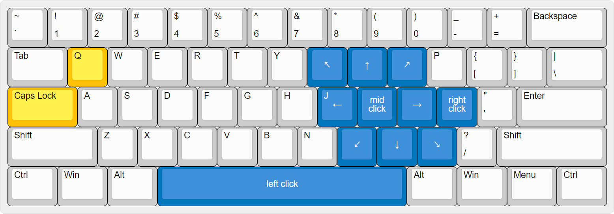

a. 金色：前缀键    b.深蓝色：重映射按键

这是一套仿系统方法，有一些区别。

空格模拟鼠标左键，k键模拟鼠标中键，分号模拟鼠标右键。

注意到，这里使用的是八向控制，而不是四向，这是有原因的：

1. 与下面的方法相兼容

2. 这样实现斜向移动比较简单，而组合键实现斜向移动在ahk中比较困难。

经典方法在效率上很低，尤其是对于大幅移动鼠标的操作很不友好。为了弥补这一缺陷，我设计了这样一种方法。

## 2. CapsLock + q + d + 数字热键后缀，九分法

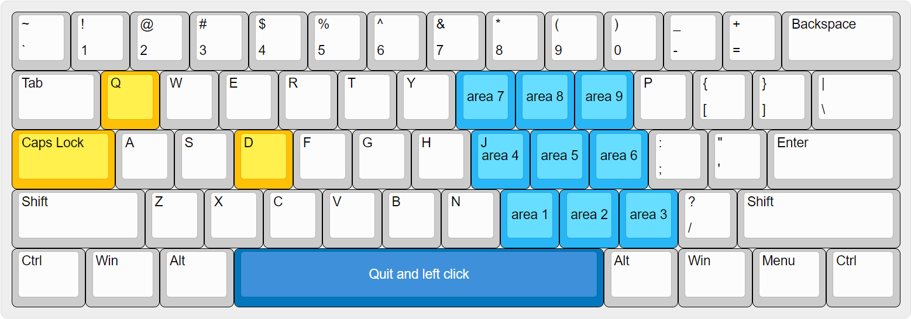

a. 金色：前缀键    b.深蓝色：重映射按键    c.天蓝色：选择区域

按CapsLock + q 再按住 d，激活九分法操作模式。

将整个屏幕设为选区，以 3x3 分为 9 个方格。选区呈现为不同明暗的透明窗格。

接着，使用数字热键后缀，选择对应位置的方格。

此时，鼠标会移动到此位置的中心，选取会缩小到此方格的位置，并继续按 3x3 分为 9 份。

如此迭代，使得鼠标的可选区域每次缩小到原来的1/9，最终使得屏幕上每一个像素都有办法到达。

最后，松开d键返回经典操作模式，或按空格释放左键并返回。

经实验，在我的屏幕上（2520x1680）该方法效率十分可观。平均而言，只需要将选取缩小3次就能将鼠标移动到目标区域，对于比较小的区域，最多也只需4次。

但是，相比于鼠标操作，该方法不够直观，需要一定时间练习。熟练后效率会很高。

另外，此方法很好玩，可以无聊时找乐子。:D

# 六、其他

## 1. 关于安全性

本脚本完全使用autohotkey开发，代码开源。同时，autohotkey也是开源的，可以保证相当高的安全性。

## 2. 关于个性化编辑

您可以对此脚本进行编辑，甚至是再次发布，因为本脚本使用MIT开源协议。

然而，本脚本涉及到大量3键、4键热键，而autohotkey通常情况下仅支持2键个性化组合键（个性化组合键简单地说是不包含ctrl、shift之类键的组合键）。实现这些3键、4键热键使用了一些小技巧。并且，它们被调制过以确保不会互相冲突。所以，假如需要更改脚本中的部分内容，您需要对autohotkey有一定的了解，否则可能会出现意料之外的情况。
